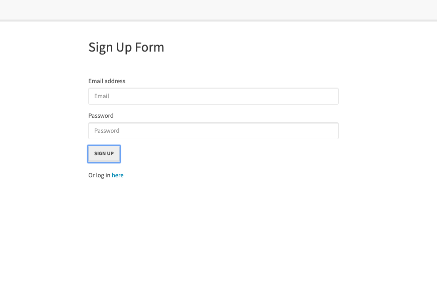
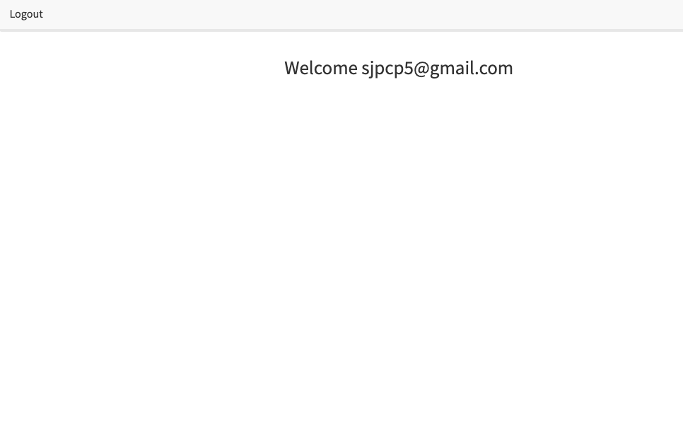

# Dev Application Description

An exercise to explain the given full-stack application. Task was
to reverse engineer the starter code provided and create a tutorial for the code.

[Google Doc link to Description of Code](https://docs.google.com/document/d/1957nJZ1UsC3whNt7C5138b3GPwETF8ZI-zGv1ZNrt7I/edit?usp=sharing)





## User story

```
AS A developer I WANT to walk-through of the codebase
SO THAT I can use it as a starting point for a new project.

```

## Business Context

When joining a new team, I will be expected to inspect a lot of code that I have never seen before. Rather than having a team member explain every line for me, I will dissect the code by myself, saving any questions for a member of your team.

## Acceptance Criteria

```md
GIVEN a Node.js application using Sequelize and Passport
WHEN one follows the walkthrough
THEN one will understand the codebase
```
